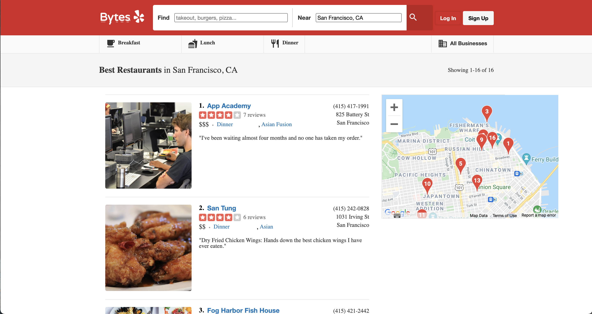
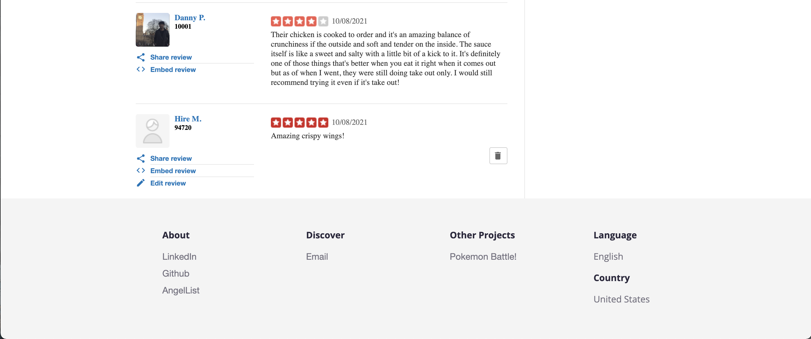

# bytes

<a href="https://eat-bytes.herokuapp.com/#/">Live Site</a>

 
Bytes, a Yelp clone, is a social media application that allows users to discover new restaurants and share their experiences by writing reviews.

### Technologies
* React and Redux
* Ruby on Rails
* PostgreSQL
* HTML and CSS

### Maps
The built in Google Maps features allows users to accurately see where each resturant is located. One of the primary factors for choosing a resturant is location and proximity. Users can zoom in and out to see more geographical context and pan around the map. The map is not only available on the index page, but each show page as well.
 
 

### Reviews
One of the most important aspects of Bytes is the ability to share and interact with other users. Users can not only read the experiences of other users, but if they are logged in, they can write reviews and share their insights as well. If they are not logged in, they will be promoted to do so. When a user is logged in, they can delete and edit their review.
 
 

## Anticipated Features
Some anticipated updates for the future are:  
• Search Functionality  
• User Profile / Friends  
• Markings reviews as funny, cool, or useful.  
